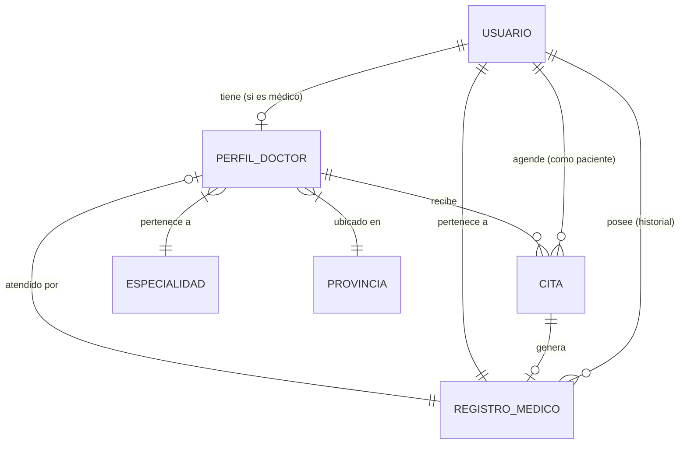

# Estructura de Base de Datos - Plataforma Médica Panamá
---
Proyecto: [[Proyecto de Medicina]]
---
[Volver al Proyecto Principal]([[Proyecto de Medicina]])

Para este proyecto, se recomienda una base de datos relacional (como PostgreSQL en Supabase) o una base de datos de documentos con relaciones bien definidas (como Firestore). A continuación, presento el esquema propuesto para cubrir todas las funcionalidades del MVP.

## 1. Diagrama de Entidad-Relación

## 2. Definición de Tablas/Colecciones

### Tabla: `usuarios`
Almacena la información básica de acceso y contacto.
*   `id`: UUID (Primary Key)
*   `email`: String (Unique)
*   `nombre_completo`: String
*   `rol`: Enum ('paciente', 'medico', 'admin')
*   `telefono`: String
*   `tipo_sangre`: String (Opcional, para perfil médico)
*   `cedula`: String (Opcional, para validación en Panamá)
*   `fecha_nacimiento`: Date
*   `created_at`: Timestamp

### Tabla: `perfiles_doctores`
Información pública y profesional de los médicos.
*   `id`: UUID (Primary Key, FK a `usuarios.id`)
*   `especialidad_id`: FK a `especialidades.id`
*   `provincia_id`: FK a `provincias.id`
*   `ciudad`: String
*   `clinica_nombre`: String
*   `direccion_detallada`: Text
*   `biografia`: Text
*   `precio_consulta`: Decimal
*   `foto_url`: String
*   `rating_promedio`: Float
*   `verificado`: Boolean (Default: false)

### Tabla: `registros_medicos` (Cronología)
Esta es la tabla que alimenta el "Timeline" del paciente.
*   `id`: UUID (Primary Key)
*   `paciente_id`: FK a `usuarios.id`
*   `doctor_id`: FK a `perfiles_doctores.id` (Opcional, puede ser un registro manual)
*   `fecha_consulta`: Timestamp
*   `tipo_registro`: Enum ('consulta_general', 'especialista', 'laboratorio', 'urgencias')
*   `diagnostico`: Text
*   `notas_doctor`: Text (Solo visible para el doctor si el paciente permite)
*   `prescripcion`: Text (O medicamentos recetados)
*   `archivos_adjuntos`: Array de URLs (PDFs, Imágenes de exámenes)
*   `publico_para_doctores`: Boolean (Control de privacidad)

### Tabla: `citas`
Gestión de la agenda.
*   `id`: UUID (Primary Key)
*   `paciente_id`: FK a `usuarios.id`
*   `doctor_id`: FK a `perfiles_doctores.id`
*   `fecha_hora`: Timestamp
*   `estado`: Enum ('pendiente', 'confirmada', 'completada', 'cancelada')
*   `motivo`: String

### Tablas Maestras (Catalogos)
*   **`especialidades`**: id, nombre (Urología, Pediatría, etc.)
*   **`provincias`**: id, nombre (Panamá, Chiriquí, Colón, etc.)

## 3. Seguridad y Privacidad (Crucial para este proyecto)
1.  **Encriptación:** Los campos sensibles en `registros_medicos` (diagnósticos) deben estar encriptados en reposo.
2.  **Tokens de Acceso Temporal (QR):** Implementar una tabla de `permisos_temporales` que asocie a un doctor con el historial de un paciente por un tiempo limitado (ej. 2 horas).
